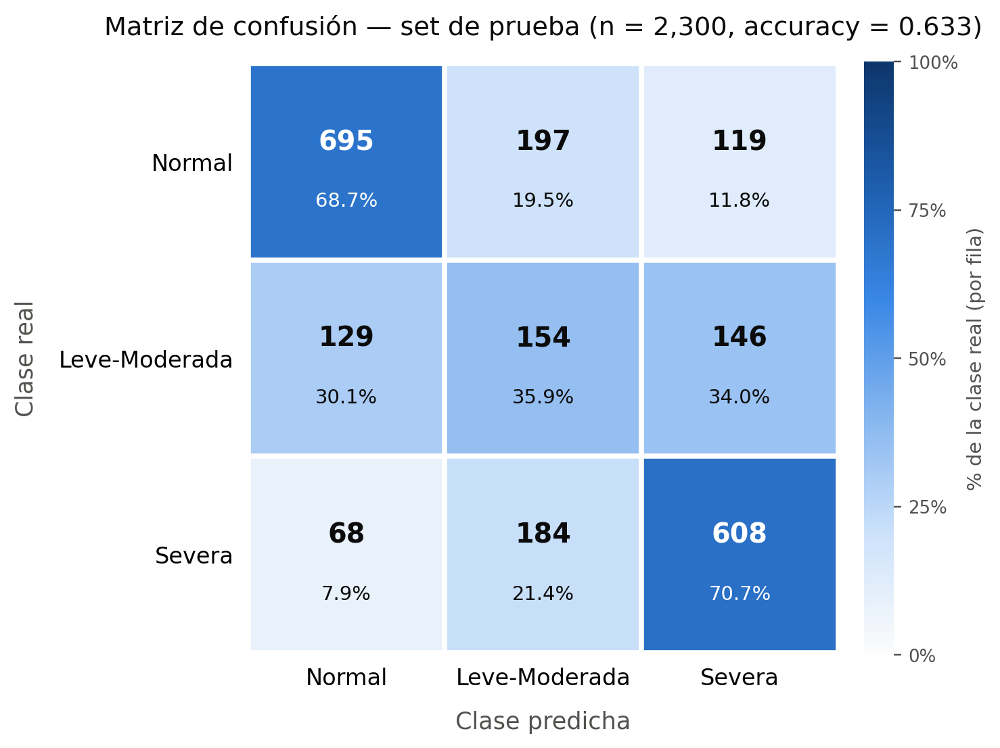
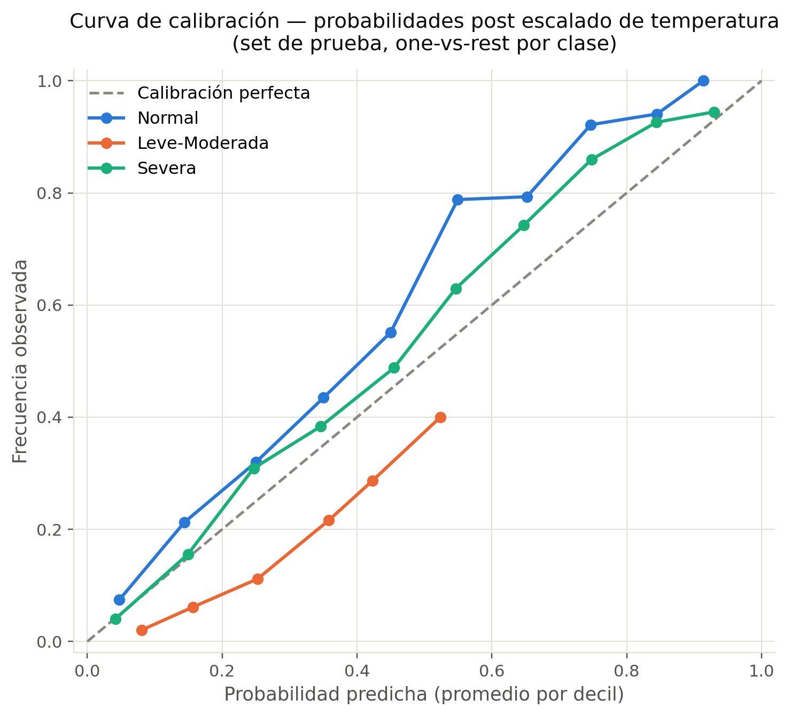
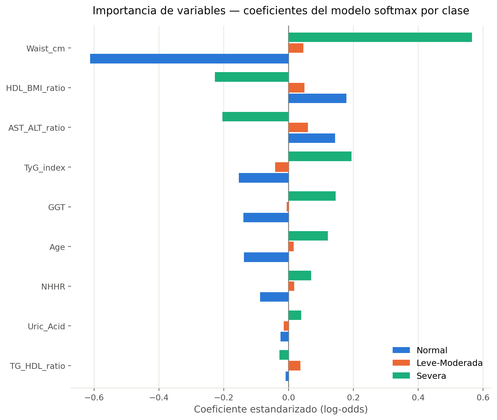

# HepatoIA — Cribado no invasivo de esteatosis hepática con aprendizaje automático

Proyecto para ExpoCiencias 2026 / 15.º EJIEM. Instituto Tecnológico de Morelia, Ingeniería Biomédica.

HepatoIA es un modelo de **apoyo a la decisión clínica**. Estima la severidad de la esteatosis hepática no alcohólica en **3 niveles** (`Normal`, `Leve_Moderada`, `Severa`) usando solo variables clínicas y de laboratorio de rutina, sin elastografía. Entrega probabilidades calibradas por clase y la contribución de cada variable a la predicción.

> **Nota clínica:** el modelo no diagnostica por sí solo. Es una herramienta de cribado que siempre debe interpretar personal médico (enfoque *human-in-the-loop*, siguiendo los lineamientos SaMD de IMDRF/FDA).

---

## Guía de lectura para revisión

| Si quieres ver… | Abre |
|---|---|
| El resumen técnico del modelo (datos, métricas, limitaciones) | [`MODEL_CARD.md`](MODEL_CARD.md) |
| Cómo se construyó la cohorte desde NHANES | [`build_hepatoia_dataset.py`](build_hepatoia_dataset.py) |
| El entrenamiento, la calibración y la evaluación | [`train_hepatoia_model.py`](train_hepatoia_model.py) |
| Cómo se usa el modelo entrenado para un paciente nuevo | [`hepatoia_predictor.py`](hepatoia_predictor.py) |
| Todas las métricas (train / calibración / test) | [`artifacts/training_report.json`](artifacts/training_report.json) |
| Los coeficientes del modelo entrenado | [`artifacts/hepatoia_model.json`](artifacts/hepatoia_model.json) |
| Las figuras (matriz de confusión, calibración, importancia, correlaciones, pipeline) | [`reporte/`](reporte/) |
| El artículo en extenso | [`docs/`](docs/) |
| Una demo en el navegador | [`interfaz_prueba.html`](interfaz_prueba.html) (descárgalo y ábrelo; no necesita servidor) |

---

## 1. Datos

Se combinan dos ciclos públicos de **NHANES** (CDC, EE. UU.), unidos por el identificador `SEQN`:

| Ciclo | Archivos crudos | N después de filtros |
|---|---|---:|
| 2017–marzo 2020 (pre-pandemia) | `data/raw/nhanes_2017_2020/P_*.xpt` | 6,823 |
| Agosto 2021–2023 | `data/raw/nhanes_2021_2023/*_L.xpt` | 4,682 |
| **Total** | | **11,505** |

Los ciclos no se traslapan (rangos de `SEQN` distintos).

**Filtros de cohorte:**

- Adultos (≥ 18 años)
- No embarazadas
- Examen de elastografía (VCTE/FibroScan) completo (`LUAXSTAT == 1`)
- Lectura confiable (IQR/mediana < 30 %)
- Se excluye el consumo excesivo de alcohol (misma definición que Lin et al. 2025, PLOS ONE, pone.0319851), para que la etiqueta refleje esteatosis **no alcohólica**

**Etiqueta:** grado de esteatosis derivado del **CAP** (parámetro de atenuación controlada):

- `Normal` = S0
- `Leve_Moderada` = S1 + S2 (se unieron porque la clase intermedia estaba muy subrepresentada)
- `Severa` = S3

Distribución: Normal 5,057 · Leve_Moderada 2,146 · Severa 4,302.

Dataset final: [`artifacts/hepatoia_final_dataset_v2.csv`](artifacts/hepatoia_final_dataset_v2.csv)

## 2. Variables predictoras (9)

| Variable | Descripción |
|---|---|
| `Waist_cm` | Circunferencia de cintura |
| `Age` | Edad |
| `GGT` | Gamma-glutamil transferasa |
| `Uric_Acid` | Ácido úrico |
| `TG_HDL_ratio` | Triglicéridos / HDL |
| `AST_ALT_ratio` | AST / ALT |
| `TyG_index` | ln(TG × glucosa / 2) |
| `HDL_BMI_ratio` | HDL / IMC |
| `NHHR` | Colesterol no-HDL / HDL |

Las variables se seleccionaron para evitar colinealidad (VIF < 2). Se descartaron el IMC, los triglicéridos crudos y el colesterol total por colinealidad. La hipertensión se evaluó (V de Cramér = 0.206) pero no se incluyó para reducir fricción clínica.

**Bloqueadas para evitar fuga de datos:** `CAP_dBm`, `LSM_kPa`, los grados derivados y `SEQN`. Estas variables vienen del mismo FibroScan que define la etiqueta, así que usarlas sería "hacer trampa".

## 3. Modelo

- **Regresión logística multinomial (softmax) regularizada con L2**, implementada desde cero en NumPy con descenso de gradiente
- **Pesos por clase** para compensar el desbalance
- **Calibración por temperatura** (generalización multiclase de Platt scaling), ajustada en un conjunto de calibración separado
- **Partición estratificada:** entrenamiento 6,904 · calibración 2,301 · prueba 2,300 (semilla 42)
- **Explicabilidad:** contribución de cada variable en log-odds para la clase predicha

## 4. Resultados (conjunto de prueba)

| Métrica | Valor |
|---|---:|
| Exactitud | 0.634 |
| AUC macro (uno contra todos) | 0.792 |
| F1 macro | 0.584 |
| Especificidad macro | 0.820 |
| Exactitud dentro de ±1 clase adyacente | **0.919** |
| Confusión entre extremos (Normal ↔ Severa) | **0.081** |

AUC por clase: Normal 0.854 · Leve_Moderada 0.665 · Severa 0.856.

La clase intermedia es la más difícil de separar. Estudios comparables con NHANES reportan el mismo patrón (p. ej., Wang et al. 2025, *BMC Gastroenterology*: AUC 0.66 para su nivel intermedio). Clínicamente, lo más relevante es que el modelo **rara vez confunde un hígado normal con uno severo**.

Figuras en [`reporte/`](reporte/):





## 5. Cómo reproducirlo

Requiere Python 3.10 o superior.

```bash
pip install -r requirements.txt

# 1) Construir el dataset desde los .xpt crudos de NHANES
python build_hepatoia_dataset.py

# 2) Entrenar, calibrar y evaluar (genera artifacts/hepatoia_model.json y training_report.json)
python train_hepatoia_model.py

# 3) Predicción de ejemplo para un paciente
python hepatoia_predictor.py
```

El predictor acepta las 9 variables ya calculadas o los valores crudos de laboratorio (triglicéridos, HDL, AST, ALT, glucosa, IMC, colesterol total) y calcula él mismo las razones derivadas.

## 6. Estructura del repositorio

```text
├── README.md                     este archivo
├── MODEL_CARD.md                 ficha técnica del modelo
├── requirements.txt              dependencias de Python
├── build_hepatoia_dataset.py     NHANES crudo → dataset final
├── train_hepatoia_model.py       entrenamiento, calibración y evaluación
├── hepatoia_predictor.py         predicción para un paciente nuevo
├── interfaz_prueba.html          demo local en el navegador
├── data/raw/                     archivos .xpt originales de NHANES (datos públicos)
├── artifacts/                    dataset final, modelo entrenado y reportes JSON
├── reporte/                      figuras y matriz de correlación
├── alternative_pipeline/         enfoque alternativo explorado (regresión de CAP + reglas clínicas)
└── docs/                         artículo en extenso (.docx)
```

### Enfoque alternativo explorado

`alternative_pipeline/` contiene un enfoque de dos etapas que se probó antes: una regresión para estimar el CAP y luego reglas clínicas fijas para asignar la severidad. Se conserva como referencia. El modelo principal del proyecto es la clasificación directa en 3 clases descrita arriba.

### Aplicación Livest

El modelo se integra en **Livest**, una aplicación de escritorio local (Python/PyQt + SQLite) desarrollada por el equipo. Esa aplicación no forma parte de este repositorio.

## 7. Limitaciones y trabajo futuro

- Sin validación externa todavía (solo validación interna con una partición estratificada)
- No se han incorporado los pesos muestrales de NHANES
- Falta validación cruzada k-fold
- Falta analizar el desempeño y la calibración por subgrupos (sexo, grupo de edad)
- La clase `Leve_Moderada` tiene menor discriminación, probablemente porque el CAP es una medida continua que se corta en categorías
- Antes de cualquier uso clínico real se necesita un plan de validación tipo dispositivo médico

## Fuente de datos

National Center for Health Statistics (NCHS), Centers for Disease Control and Prevention. *National Health and Nutrition Examination Survey (NHANES)*. Datos de dominio público: https://wwwn.cdc.gov/nchs/nhanes/
